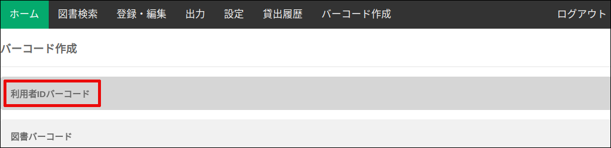
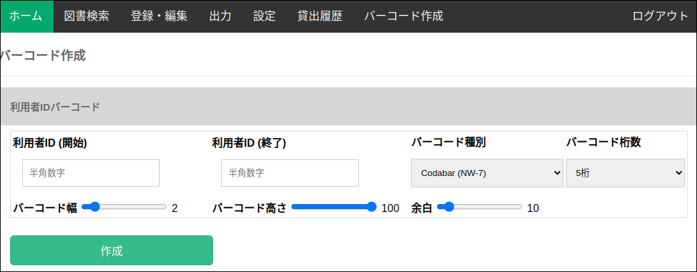
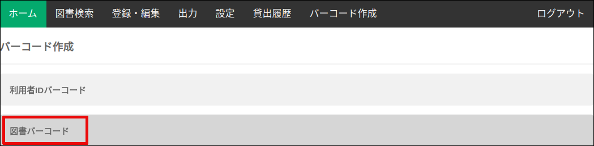

### 利用者IDバーコード作成

バーコード作成画面の ”利用者IDバーコード” タブをクリックします。

バーコードを作成してい利用者IDの範囲を、開始IDと終了IDで指定します。

バーコードが指定した桁数に満たない場合は、先頭に0が付加されます。
先頭に0を付加したく無い場合は、"固定しない"を選択します。

必要に応じて、バーコードの幅、高さ、余白を変更します。

### 図書IDバーコード作成

バーコード作成画面の ”利用者IDバーコード” タブをクリックします。

以降の手順は、利用者IDバーコード作成と同じです。

