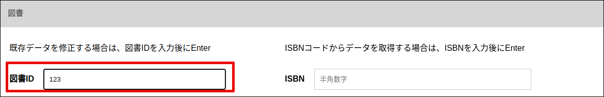
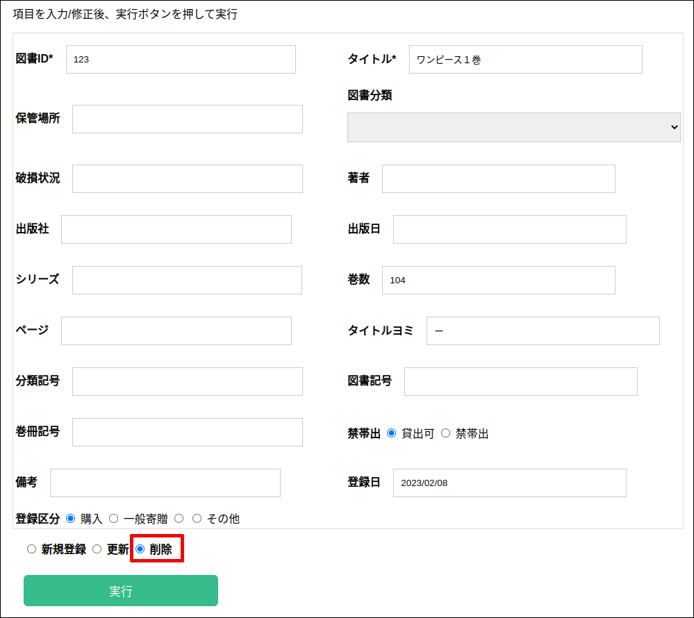

### 図書登録

登録編集画面の ”図書” タブをクリックします。

項目を入力後、”新規登録” がチェックされている状態で、”実行”ボタンを押します。

### 図書編集

図書IDを入力後にEnterを押してデータを読み出した後、変更する項目を修正します。

ISBNコードからメタデータを取得する場合は、ISBNコードを入力後にEnterを押してデータを取得します。

項目を入力後、”更新” がチェックされている状態で、”実行”ボタンを押します。

### 図書削除

項目を入力後、”削除” がチェックされている状態で、”実行”ボタンを押します。

