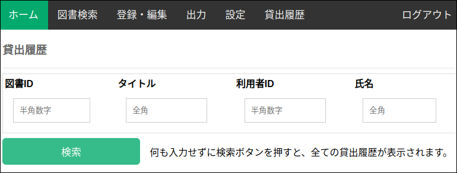
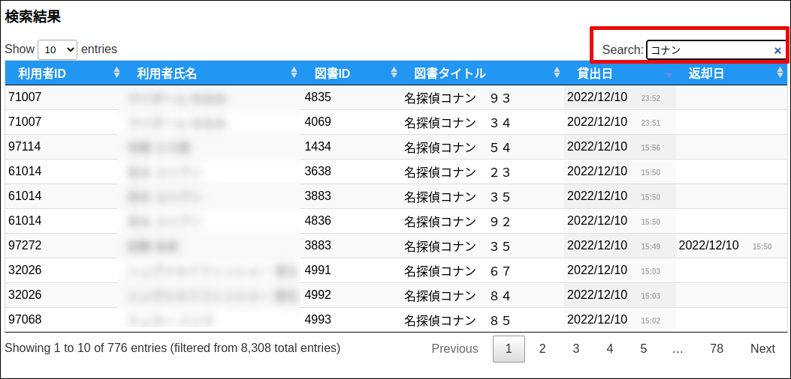

### 貸出履歴

貸出履歴画面で貸出履歴を確認できます。

条件を指定せずに、”検索” ボタンを押すと、保存しているすべての貸出履歴が表示されます。

尚、貸出履歴は最新の100,000件が保存され、それより古い履歴は自動消去されます。

以下の条件を指定して絞り込み検索が可能です。

* 図書ID
* タイトル
* 利用者ID
* 氏名

検索結果画面の右上の ”Search”欄に検索キーワードを指定することで、検索結果に対して絞り込むことも可能です。

