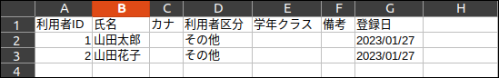
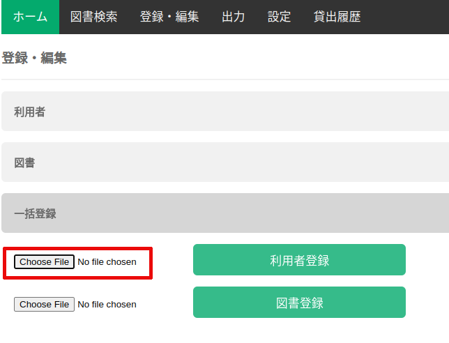
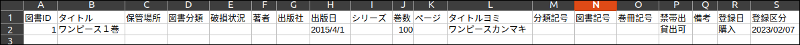
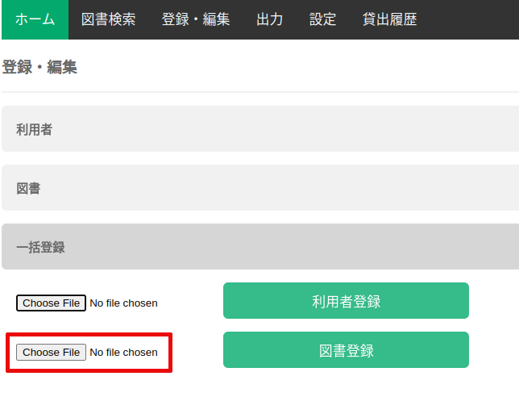

### 一括登録

登録情報を記入したCSVファイルをアップロードすることで、複数の利用者もしくは図書を一括登録することが可能です。

尚、CSVファイルで一度に登録できるのは、最大1,000件です（3,000件を登録するためには、CSVファイルのアップロードを3回繰り返して下さい）。

#### 利用者一括登録

以下の形式のCSVファイルを用意します。

1行目(ヘッダ)は読み飛ばされます。2行目以降に登録するユーザ情報を入力していきます(最大1,000件)。

登録・編集画面の ”一括登録” タブをクリックします。

ファイル選択ボタンを押して、アップロードするCSVファイルを選択し、”利用者登録” ボタンを押します。

#### 図書一括登録

以下の形式のCSVファイルを用意します。

1行目(ヘッダ)は読み飛ばされます。2行目以降に登録する図書情報を入力していきます(最大1,000件)。

登録・編集画面の ”一括登録” タブをクリックします。

ファイル選択ボタンを押して、アップロードするCSVファイルを選択し、”図書登録” ボタンを押します。

