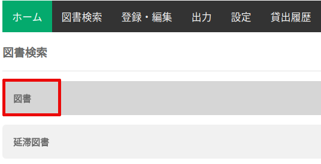

### 利用者検索

ホーム画面の ”利用者検索” タブをクリックします。

条件を指定せずに、”検索” ボタンを押すと、すべての利用者が表示されます。

以下の条件を指定して絞り込み検索が可能です。

* 氏名
* カナ
* 利用者ID
* 利用者区分

検索結果画面の右上の ”Search”欄に検索キーワードを指定することで、検索結果に対して絞り込むことも可能です。

### 図書検索

図書検索画面の ”図書” タブをクリックします。

条件を指定せずに、”検索” ボタンを押すと、すべての図書が表示されます。

以下の条件を指定して絞り込み検索が可能です。

* タイトル
* ID
* ヨミ
* 著者

検索結果画面の右上の ”Search”欄に検索キーワードを指定することで、検索結果に対して絞り込むことも可能です。

### 遅延図書検索

図書検索画面の ”遅延図書” タブをクリックします。

条件を指定せずに、”検索” ボタンを押すと、すべての遅延図書が表示されます。

検索結果画面の右上の ”Search”欄に検索キーワードを指定することで、検索結果に対して絞り込むことも可能です。

