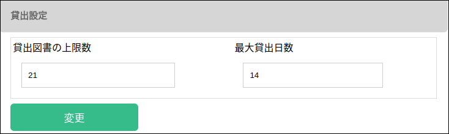
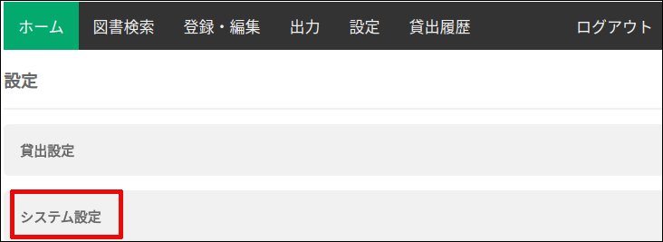
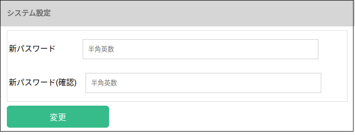

### 設定

#### 貸出設定

設定画面の ”貸出設定” タブをクリックします。

変更した項目を修正して、”変更” ボタンを押します。

* 貸出図書の上限数
利用者一人当たりに貸出可能な図書の上限数です。

* 最大貸出日数
貸出日数がこの値を超えると、遅延図書に分類されます。

#### システム設定

設定画面の ”システム設定” タブをクリックします。

変更した項目を修正して、”変更” ボタンを押します。

