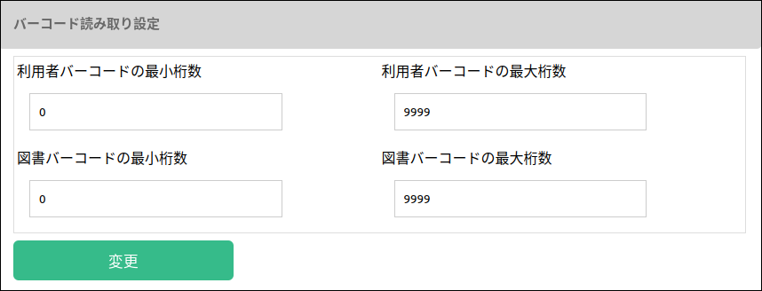

### 設定

変更したい項目を修正して、”変更” ボタンを押します。

#### 貸出設定

##### 貸出図書の上限数

利用者一人当たりに貸出可能な図書の上限数です。

##### 最大貸出日数

貸出日数がこの値を超えると、遅延図書に分類されます。

#### バーコード読み取り設定

この設定は、貸出・返却処理にのみ適用されます。
各種検索処理で入力するIDには適用されません。

##### 利用者バーコードの最小桁数

利用者バーコードの桁数がこの値よりも小さい場合、貸出・返却処理はエラーになります。

##### 利用者バーコードの最大桁数

利用者バーコードの桁数がこの値よりも大きい場合、貸出・返却処理はエラーになります。

##### 図書バーコードの最小桁数

図書バーコードの桁数がこの値よりも小さい場合、貸出・返却処理はエラーになります。

##### 図書バーコードの最大桁数

図書バーコードの桁数がこの値よりも大きい場合、貸出・返却処理はエラーになります。

