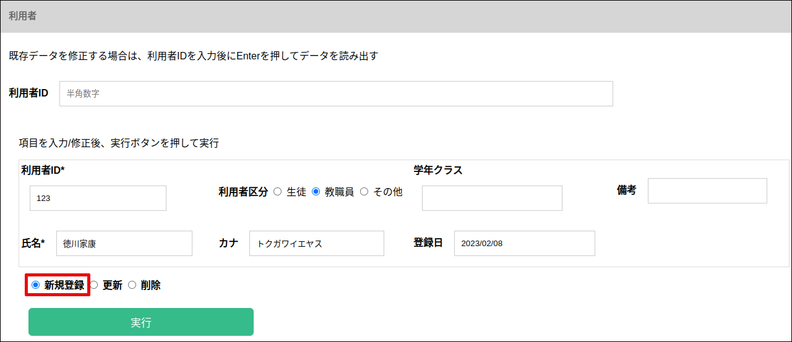
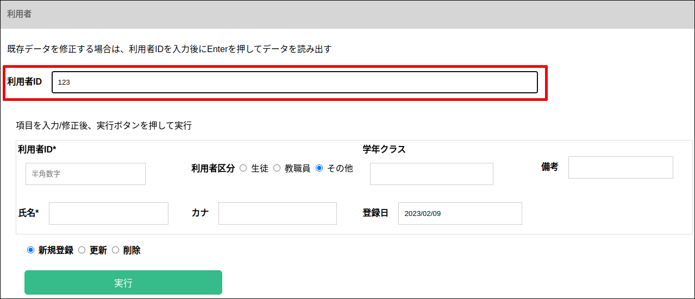
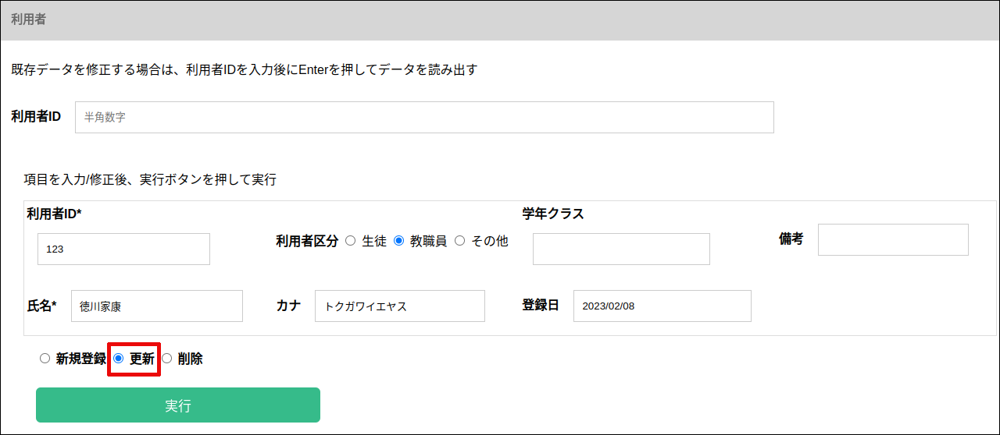

### 利用者登録

登録編集画面の ”利用者” タブをクリックします。

項目を入力後、”更新” がチェックされている状態で、”実行”ボタンを押します。

入力した利用者IDが未登録の場合は、新規に利用者が登録されます。

入力した利用者IDが登録済みの場合は、入力内容で更新されます。

### 利用者編集

利用者IDを入力後にEnterを押してデータを読み出した後、変更する項目を修正します。

項目を入力後、”更新” がチェックされている状態で、”実行”ボタンを押します。

### 利用者削除

項目を入力後、”削除” がチェックされている状態で、”実行”ボタンを押します。

